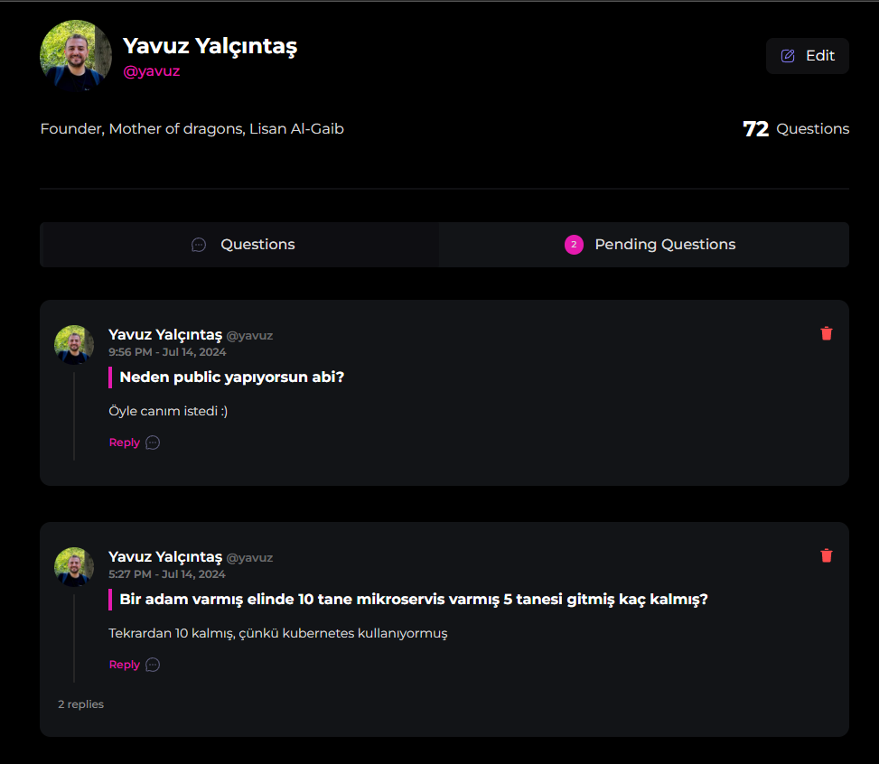
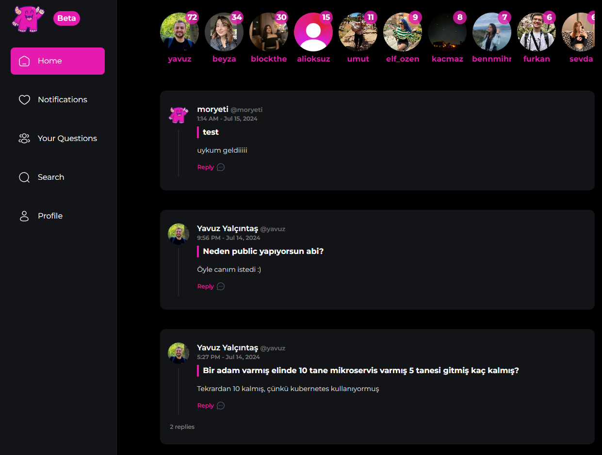

<div align="center">
  <div>
    
    
    
    
    
    
    
  </div>

  <h2 align="center">Anonymoys Q&A Social Media</h2>
</div>





## <a name="tech-stack">⚙️ Tech Stack</a>

- Next.js
- MongoDB
- Shadcn UI
- TailwindCSS
- Clerk
- Webhooks
- Serverless APIs
- React Hook Form
- Zod
- TypeScript

## <a name="quick-start">🤸 Quick Start</a>

Follow these steps to set up the project locally on your machine.

**Prerequisites**

Make sure you have the following installed on your machine:

- [Git](https://git-scm.com/)
- [Node.js](https://nodejs.org/en)
- [npm](https://www.npmjs.com/) (Node Package Manager)

**Installation**

Install the project dependencies using npm:

```bash
npm install
```

**Set Up Environment Variables**

Create a new file named `.env` in the root of your project and add the following content:

```env
MONGODB_URL=
CLERK_SECRET_KEY=
UPLOADTHING_SECRET=
UPLOADTHING_APP_ID=
NEXT_CLERK_WEBHOOK_SECRET=
NEXT_PUBLIC_CLERK_PUBLISHABLE_KEY=
```

Replace the placeholder values with your actual credentials. You can obtain these credentials by signing up for the corresponding websites on [MongoDB](https://www.mongodb.com/), [Clerk](https://clerk.com/), and [Uploadthing](https://uploadthing.com/). 

**Running the Project**

```bash
npm run dev
```

Open [http://localhost:3000](http://localhost:3000) in your browser to view the project.

#
